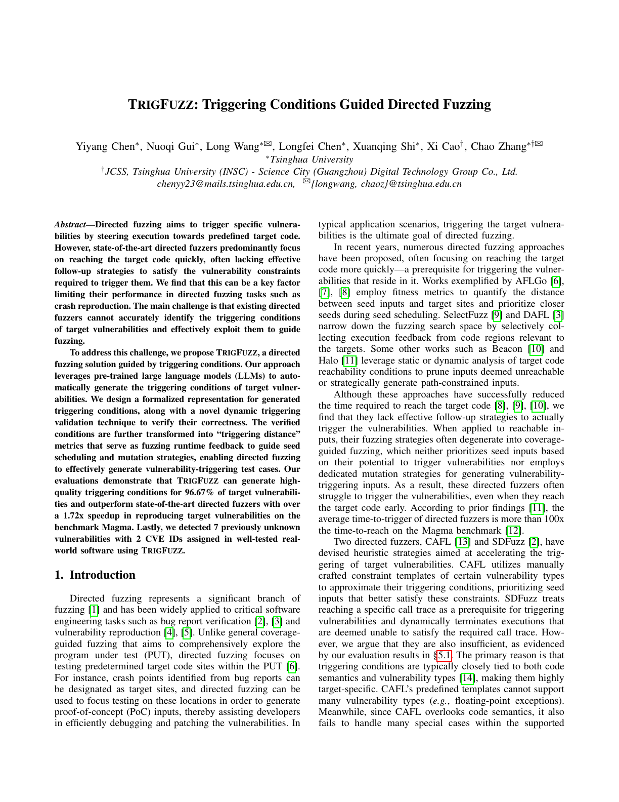

# TrigFuzz

<a href="https://vul337.github.io/TrigFuzz/trigfuzz.pdf"></a>

Official code repository for the research paper [*TrigFuzz: Triggering Conditions Guided Directed Fuzzing*](https://vul337.github.io/TrigFuzz/trigfuzz.pdf) (IEEE S&P 2026). TrigFuzz is a directed fuzzing tool that leverages LLMs to extract vulnerability triggering conditions for PoC generation.

<br clear="right">

## Citation

```bibtex
@inproceedings{chen2026trigfuzz,
  title={TRIGFUZZ: Triggering Conditions Guided Directed Fuzzing},
  author={Chen, Yiyang and Gui, Nuoqi and Wang, Long and Chen, Longfei and Shi, Xuanqing and Cao, Xi and Zhang, Chao},
  booktitle={2026 IEEE Symposium on Security and Privacy (SP)},
  pages={4128--4146},
  year={2026},
  organization={IEEE}
}
```

## Release Options

This release contains two usable paths:

| option | directory | purpose |
|---|---|---|
| AFLGo based TrigFuzz | `engines/aflgo-trigfuzz` | Paper-aligned AFLGo implementation with triggering-distance scheduling as the default. Triggering byte-aware mutation is available as an optional config. |
| Selective AFL++ based TrigFuzz | `engines/aflplusplus-selective` | AFL++ implementation with TrigFuzz feedback and conservative SelectFuzz-style selective instrumentation for better Magma performance in our local evaluation. |

The shared Python tooling lives in `trigfuzz/`. The target-side AFLGo runtime header is `distance.h`; the AFL++ runtime header is `engines/aflplusplus-selective/include/trigfuzz-distance.h`.

## Environment

The release workflow was tested on Ubuntu 22.04.5 LTS with:

- Python 3.10;
- GCC 11;
- LLVM/Clang 14;
- GNU make;
- CMake;
- the OpenAI Python SDK for TC generation;
- `pytest` for the Python test suite.

Install the Python dependencies:

```sh
python3 -m pip install openai pytest
```

Build dependencies vary by engine:

- AFLGo based TrigFuzz uses the bundled AFLGo/AFL source tree and builds with `make clean all`.
- Selective AFL++ based TrigFuzz uses the bundled AFL++ source tree and builds with `make source-only`.
- AFL++ gcc-plugin mode needs GCC plugin development headers.
- AFL++ Nyx mode is optional and requires Rust; the normal source-instrumentation build does not require Nyx.

Runtime environment variables used by the workflow:

| variable | purpose |
|---|---|
| `OPENAI_API_KEY` | API key for TC generation. |
| `OPENAI_MODEL` | Optional model override for TC generation. |
| `OPENAI_API_BASE_URL` / `OPENAI_BASE_URL` | Optional OpenAI-compatible API base URL. |
| `TRIGFUZZ_AFL` | Optional override for the AFLGo based `afl-fuzz` binary. |
| `TRIGFUZZ_AFL_GCC` | Optional override for the AFLGo based `afl-gcc` compiler wrapper. |
| `AFL_TRIG_ENABLE_BYTE_AWARE_MUTATION` | Opt-in switch for the triggering byte-aware mutation stage. |
| `AFL_TRIG_MUTATION_MODE` | Optional byte-aware mutation strategy: `diff`, `scan`, or `hybrid`. |
| `AFL_TRIGFUZZ_ENABLE` | Enables TrigFuzz feedback in the AFL++ based engine. |
| `AFL_TRIGFUZZ_INS_NUM` | Number of TCU distance slots for the AFL++ based engine. |
| `AFL_TRIGFUZZ_SEQ_NUM` | Number of TCU sequence groups for the AFL++ based engine. |
| `AFL_TRIGFUZZ_SELECTIVE_FILE` | Selective instrumentation keep-list path for the AFL++ based engine. |

## Complete Workflow

### 1. Prepare a target directory

```text
my-target/
  bug_report.json
  source/
    parser.c
    parser.h
  seeds/
    seed0
  build.sh              # optional, for non-single-file targets
  funcs.json            # optional, function-name -> numbered source map
```

`bug_report.json` should identify the vulnerability type and target crash or bug location:

```json
{
  "type": "heap-buffer-overflow",
  "crash_points": ["line 5973 in tif_dirread.c"],
  "summary": "Short bug description and relevant constraints"
}
```

For small targets, putting the relevant C/C++ files under `source/` is enough. For larger targets, `funcs.json` lets the progressive TC generation agent fetch extra function bodies when the model asks for them.

### 2. Run TC generation

Install the OpenAI SDK if needed and provide an API key:

```sh
python3 -m pip install openai
export OPENAI_API_KEY=...
# optional
export OPENAI_MODEL=gpt-5
export OPENAI_API_BASE_URL=...
```

Generate candidate triggering-condition units:

```sh
cd /root/TrigFuzz
python3 -B -m trigfuzz.tcgen my-target --k 3 --out my-target/tcus.json
```

For large projects, seed the first prompt with specific files:

```sh
python3 -B -m trigfuzz.tcgen my-target \
  --source libtiff/tif_dirread.c \
  --source libtiff/tif_dir.h \
  --k 3
```

The output is `tcus.json`. It uses explicit `distance_expr` fields, which are compiled directly into `distance_instrument(...)`.

### 3. Review generated TCUs

Before fuzzing, inspect `tcus.json` for:

- correct `loc` line numbers;
- safe `distance_expr` arithmetic using helpers like `tf_gt`, `tf_sub_num`, and `tf_bool`;
- sensible `seq` order for multi-stage bugs;
- DNF grouping through `conj`.

See [docs/TCU_FORMAT.md](docs/TCU_FORMAT.md).

### 4. Build the AFLGo based engine

```sh
cd /root/TrigFuzz/engines/aflgo-trigfuzz/afl-2.57b
make clean all
```

### 5. Fuzz with generated TCUs

```sh
cd /root/TrigFuzz
python3 -B -m trigfuzz.driver my-target \
  --skip-llm \
  --quick-dirty \
  --budget 3600
```

`--skip-llm` means the driver uses the reviewed `my-target/tcus.json`. The driver instruments `source/`, builds a target binary, and runs the patched AFLGo fuzzer with `-z exp -c 10m`; `--quick-dirty` passes `-d`.

For non-single-file targets, provide `my-target/build.sh` and pass `--use-script`. The script receives:

```text
build.sh <instrumented-source-dir> <output-binary>
```

### 6. AFL++ selective path

For the selective AFL++ option, TCgen is the same. After reviewing `tcus.json`, insert the `distance_instrument(...)` calls using the AFL++ runtime header and compile with `engines/aflplusplus-selective/afl-clang-fast` under the selective instrumentation settings described in [docs/USAGE_AFLPLUSPLUS_SELECTIVE.md](docs/USAGE_AFLPLUSPLUS_SELECTIVE.md).

## Quick Start: AFLGo Based TrigFuzz

Build the AFLGo based engine:

```sh
cd engines/aflgo-trigfuzz/afl-2.57b
make clean all
```

Run the motivating example:

```sh
cd /root/TrigFuzz
python3 -B -m trigfuzz.driver examples/motivating \
  --skip-llm \
  --quick-dirty \
  --budget 60
```

The driver uses `-z exp -c 10m` by default and passes `-d` when `--quick-dirty` is set.

Triggering-distance scheduling is the default. To additionally enable the byte-aware mutation stage:

```sh
export AFL_TRIG_ENABLE_BYTE_AWARE_MUTATION=1
```

See [docs/USAGE_AFLGO.md](docs/USAGE_AFLGO.md).

## Quick Start: Selective AFL++ Based TrigFuzz

Build the AFL++ based engine:

```sh
cd engines/aflplusplus-selective
make source-only
```

Compile an instrumented target with the AFL++ compiler wrapper, include `trigfuzz-distance.h`, and enable selective instrumentation with a keep list:

```sh
export AFL_TRIGFUZZ_SELECTIVE=selectfuzz-like
export AFL_TRIGFUZZ_SELECTIVE_FILE=/path/to/selective-keep.txt
./afl-clang-fast -Iinclude -O1 -g -o target target.c
```

Run the fuzzer with TrigFuzz feedback enabled:

```sh
AFL_TRIGFUZZ_ENABLE=1 \
AFL_TRIGFUZZ_INS_NUM=64 \
AFL_TRIGFUZZ_SEQ_NUM=64 \
./afl-fuzz -i seeds -o out -m none -t 5000 -d -- ./target @@
```

See [docs/USAGE_AFLPLUSPLUS_SELECTIVE.md](docs/USAGE_AFLPLUSPLUS_SELECTIVE.md).

## Magma Demo Script

For the local Magma setup used during this release work, `PDF010` is the
default demo target. Use `--bug` to run a different local Magma target.

```sh
cd /root/TrigFuzz
bash scripts/magma/run_magma_demo.sh --budget 3600
```

Useful variants:

```sh
bash scripts/magma/run_magma_demo.sh --engine aflgo --budget 3600
bash scripts/magma/run_magma_demo.sh --engine aflpp-selective --budget 3600
bash scripts/magma/run_magma_demo.sh --bug PDF010 --engine both --budget 86400
```

The script writes a timestamped run directory under
`/root/magma-eval/trigfuzz-release-demo/`. Before fuzzing, it replays the seed
corpus against the target command line and uses a run-local filtered corpus, so
the initial AFL dry run is not stopped by seeds that already crash or time out.
It records this in `seed-filter.meta` and `seed-filter.log`, then creates
`summary.tsv` by replaying saved crashes and checking for `MAGMA_BUG`.

## TCU Metadata

Release metadata should provide `distance_expr` directly. Do not rely on old cond-only JSON for generated TCUs.

```json
[
  {
    "cond": "nstrips - 1 > limit",
    "distance_expr": "tf_gt(tf_sub_num((double)nstrips, 1.0), (double)limit)",
    "loc": "line 5973 in tif_dirread.c",
    "seq": 0,
    "conj": 0,
    "w": 1.0,
    "kind": "numeric"
  }
]
```

`cond` is a readable label. `distance_expr` is what gets compiled into the target. See [docs/TCU_FORMAT.md](docs/TCU_FORMAT.md).

## Tests

```sh
cd /root/TrigFuzz
python3 -m pytest -q
python3 -B -m py_compile trigfuzz/*.py
```

For fuzzer build checks:

```sh
make -C engines/aflgo-trigfuzz/afl-2.57b all
make -C engines/aflplusplus-selective source-only
```
